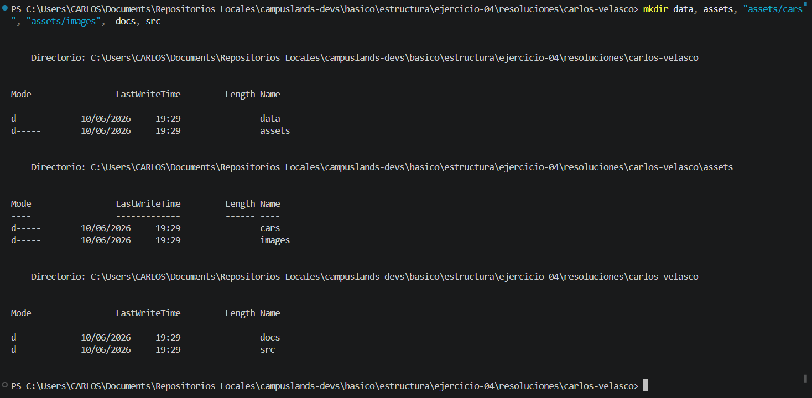
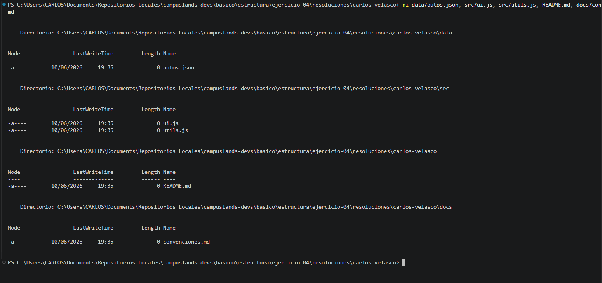

```markdown
# Ejercicio 04: Configuración de Entorno para Proyecto de Datos

## Descripción
En este ejercicio se realizó la estructuración técnica del entorno de trabajo, enfocada en la organización modular de datos, documentación y código fuente. El proceso incluyó:

* **Estructuración de directorios:** Creación de una jerarquía de carpetas diseñada para separar claramente los datos (`data`), recursos visuales (`assets/cars`), documentación (`docs`) y la lógica del programa (`src`).
* **Inicialización de archivos:** Creación simultánea de los archivos fundamentales (`autos.json`, `ui.js`, `utils.js`, `convenciones.md`) en sus rutas correspondientes para preparar el entorno de desarrollo.
* **Navegación y Gestión:** Uso de comandos avanzados de terminal para la creación masiva y eficiente de directorios y archivos.

### Estructura del Proyecto
```text
raiz/
├── assets/
│   ├── cars/
│   └── images/
├── data/
│   └── autos.json
├── docs/
│   └── convenciones.md
├── src/
│   ├── ui.js
│   └── utils.js
└── README.md

```

## Comandos Utilizados

Para replicar esta estructura, se utilizaron los siguientes comandos en la terminal:

```powershell
# Creación eficiente de la estructura de directorios
mkdir data, assets, "assets/cars", "assets/images", docs, src

# Inicialización masiva de archivos base
ni data/autos.json, src/ui.js, src/utils.js, README.md, docs/convenciones.md

```

## Checklist de validación

[x] ¿Está mi carpeta bajo el formato nombre-apellido/?
[x] ¿Están todas las carpetas necesarias (data, assets/cars, docs, src)?
[x] ¿El archivo JSON es válido?
[x] ¿He incluido una explicación en mi README.md?
[x] ¿He verificado que no modifiqué archivos fuera de mi carpeta personal?

## Evidencia



---

**Hecho por:**

* *Carlos Velasco*
