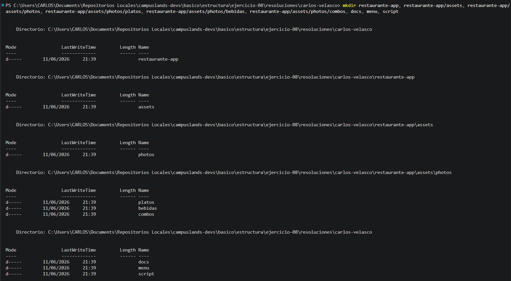
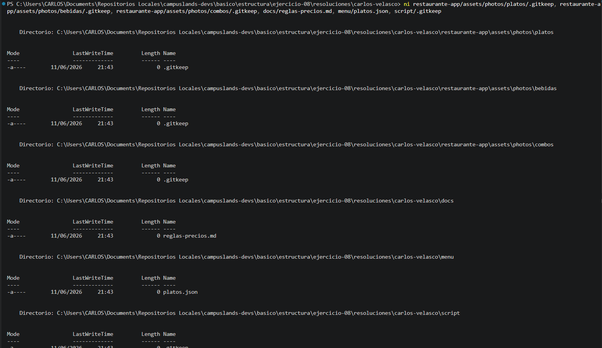

# Gestión de menú urbano

Se ha completado la arquitectura del proyecto **Restaurante-App**, diseñada para gestionar de manera eficiente la estructura de activos multimedia, documentación técnica y lógica de datos necesaria para la aplicación de un restaurante.

* **Descripción del proceso:** * **Arquitectura de Directorios:** Se implementó una estructura jerárquica compleja utilizando `mkdir` para organizar los recursos. Se definieron carpetas específicas para activos (`assets`) divididos por categorías (`platos`, `bebidas`, `combos`), además de directorios para documentación (`docs`), menú y scripts.
* **Inicialización de Archivos:** Se crearon archivos de control (`.gitkeep`) para mantener la estructura en el repositorio, junto con archivos de configuración y datos (`reglas-precios.md`, `platos.json`) para establecer las bases operativas del sistema.


* **Tecnologías:** Entorno de desarrollo (PowerShell/Terminal) y gestión de control de versiones Git.

### Comandos de Git y Shell Utilizados

```bash
# Creación de la estructura jerárquica de directorios
mkdir restaurante-app, restaurante-app/assets, restaurante-app/assets/photos, restaurante-app/assets/photos/platos, restaurante-app/assets/photos/bebidas, restaurante-app/assets/photos/combos, docs, menu, script

# Inicialización de archivos necesarios y control de carpetas
ni restaurante-app/assets/photos/platos/.gitkeep, restaurante-app/assets/photos/bebidas/.gitkeep, restaurante-app/assets/photos/combos/.gitkeep, docs/reglas-precios.md, menu/platos.json, script/.gitkeep

# Registro y consolidación de cambios en el repositorio
git add .
git commit -m "feat(estructura): ejercicio 08 finalizado"

# Sincronización con el servidor remoto
git push -u origin alumnos/carlos-velasco/ejercicio-08

```

### Evidencia





---

**Estructura del Proyecto:**

```text
restaurante-app/
├── assets/
│   └── photos/
│       ├── platos/
│       ├── bebidas/
│       └── combos/
├── docs/
│   └── reglas-precios.md
├── menu/
│   └── platos.json
└── script/

```

**Hecho por:**

* *Carlos Velasco*