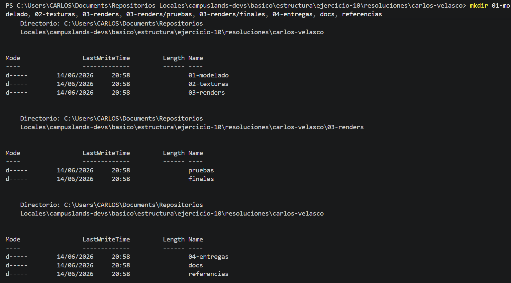
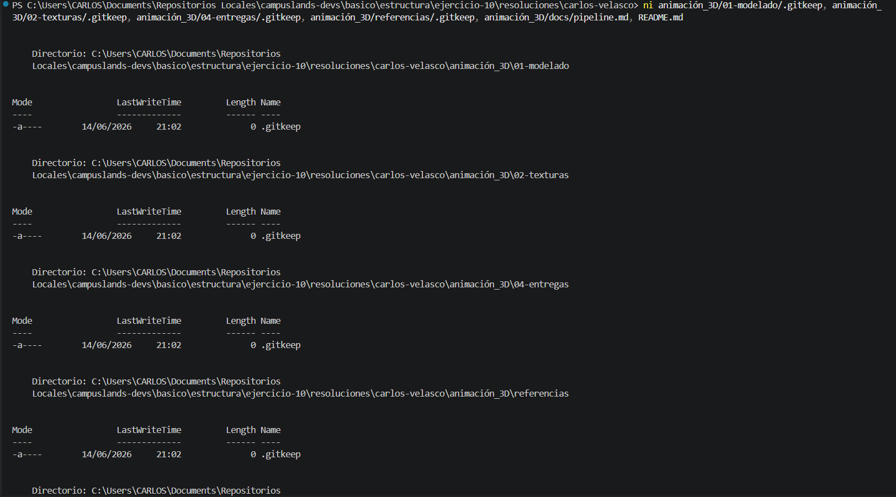

## Estructura y Configuración del Proyecto: Animación-3D

Se ha finalizado la implementación de la estructura de directorios y archivos base para el proyecto **Animación-3D**. Esta arquitectura está diseñada para gestionar un flujo de trabajo profesional de producción 3D, desde la etapa de modelado hasta la entrega final.

* **Descripción del proceso:**
* **Arquitectura de Directorios:** Se utilizó el comando `mkdir` para definir un sistema jerárquico organizado por etapas: `01-modelado`, `02-texturas`, `03-renders` (con subcarpetas de `pruebas` y `finales`), `04-entregas`, `docs` y `referencias`.
* **Inicialización de Archivos:** Se empleó el comando `ni` para generar archivos de control `.gitkeep` en los directorios clave, además de crear un archivo de documentación `pipeline.md` y el archivo `README.md` principal.


* **Tecnologías:** Entorno de terminal (PowerShell), estructuración de carpetas y control de versiones con Git.

### Comandos de Git y Shell Utilizados

```bash
# Creación de la estructura de directorios del proyecto
mkdir 01-modelado, 02-texturas, 03-renders, 03-renders/pruebas, 03-renders/finales, 04-entregas, docs, referencias

# Inicialización de archivos de control y documentación base
ni animacion_3D/01-modelado/.gitkeep, animacion_3D/02-texturas/.gitkeep, animacion_3D/04-entregas/.gitkeep, animacion_3D/referencias/.gitkeep, animacion_3D/docs/pipeline.md, README.md

# Registro y consolidación de cambios en el repositorio
git add .
git commit -m "ejercicio(estructura):Ejercicio 10 finalizado"

# Sincronización con el repositorio remoto
git push -u origin alumnos/carlos-velasco/ejercicio-10

```

### Evidencia






---

**Estructura del Proyecto:**

```text
animacion_3D/
├── 01-modelado/
├── 02-texturas/
├── 03-renders/
│   ├── pruebas/
│   └── finales/
├── 04-entregas/
├── docs/
│   └── pipeline.md
└── referencias/

```

**Hecho por:**

* *Carlos Velasco*