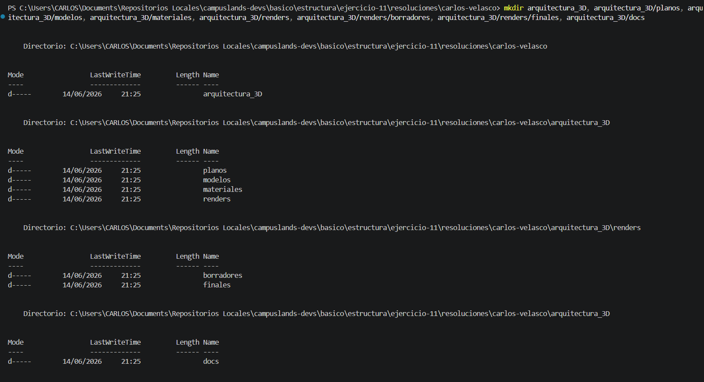
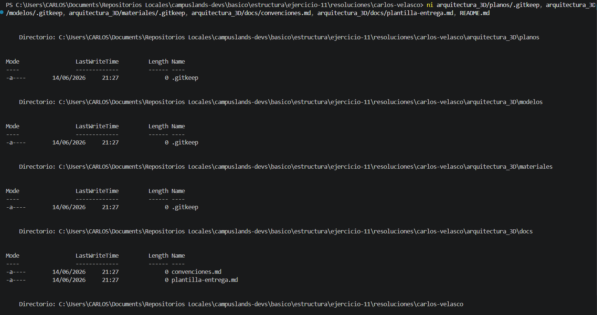

## Estructura y Configuración del Proyecto: Arquitectura-3D

Se ha completado la implementación de la infraestructura para el proyecto **Arquitectura-3D**. Esta estructura organiza los activos necesarios para el desarrollo de proyectos arquitectónicos, facilitando la gestión de planos, modelos, materiales, renders y documentación normativa.

* **Descripción del proceso:**
* **Arquitectura de Directorios:** Se utilizó el comando `mkdir` para establecer una jerarquía modular, creando subcarpetas especializadas para las distintas fases del proyecto, incluyendo `renders` con subdirectorios para borradores y versiones finales.
* **Inicialización de Archivos:** Se empleó el comando `ni` para generar archivos de seguimiento (`.gitkeep`) en directorios de activos y archivos de documentación técnica (`convenciones.md`, `plantilla-entrega.md`) para estandarizar los procesos de entrega.


* **Tecnologías:** Terminal (PowerShell), gestión de archivos y control de versiones mediante Git.

### Comandos de Git y Shell Utilizados

```bash
# Creación de la estructura de directorios del proyecto
mkdir arquitectura_3D, arquitectura_3D/planos, arquitectura_3D/modelos, arquitectura_3D/materiales, arquitectura_3D/renders, arquitectura_3D/renders/borradores, arquitectura_3D/renders/finales, arquitectura_3D/docs

# Inicialización de archivos de control y documentos técnicos
ni arquitectura_3D/planos/.gitkeep, arquitectura_3D/modelos/.gitkeep, arquitectura_3D/materiales/.gitkeep, arquitectura_3D/docs/convenciones.md, arquitectura_3D/docs/plantilla-entrega.md, README.md

# Registro y consolidación de cambios en el repositorio
git add .
git commit -m "feat(estructura): Ejercicio 11 finalizado"

# Sincronización con el repositorio remoto
git push -u origin alumnos/carlos-velasco/ejercicio-11

```

### Evidencia





---

**Estructura del Proyecto:**

```text
arquitectura_3D/
├── planos/
├── modelos/
├── materiales/
├── renders/
│   ├── borradores/
│   └── finales/
└── docs/
    ├── convenciones.md
    └── plantilla-entrega.md

```

**Hecho por:**

* *Carlos Velasco*