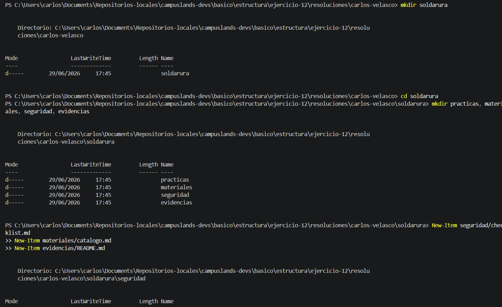

Aquí tienes el archivo `README.md` profesional para este ejercicio, documentando la estructura de directorios y la gestión de archivos mediante comandos de PowerShell.

---

## Gestión de Estructura de Proyecto: Ejercicio de Soldadura

Este ejercicio documenta la creación de una arquitectura de directorios organizada para un proyecto técnico de "soldadura". Se utiliza PowerShell para desplegar una estructura jerárquica que separa las responsabilidades del proyecto en subcarpetas lógicas.

* **Descripción del proceso:**
* **Creación de directorios:** Se utilizó `mkdir` para generar el contenedor principal `soldadura` y sus subdirectorios (`practicas`, `materiales`, `seguridad`, `evidencias`).
* **Generación de archivos:** Se utilizó `New-Item` para crear archivos de documentación (`checklist.md`, `catalogo.md`, `README.md`) dentro de sus respectivas rutas, garantizando una organización estandarizada.


* **Tecnologías:**
* PowerShell (Automatización de entornos).
* Gestión de sistemas de archivos.


### Explicación técnica: ¿Para qué sirven estos comandos?

La automatización de directorios mediante terminal es fundamental para asegurar que todos los desarrolladores trabajen bajo el mismo estándar de archivos.

1. **`mkdir` (Make Directory)**: Es el comando estándar para crear carpetas. En PowerShell, admite la creación de múltiples carpetas a la vez separándolas por comas (ej. `mkdir a, b, c`), lo que reduce drásticamente el tiempo de configuración inicial de un proyecto.
2. **`cd` (Change Directory)**: Permite navegar a través del árbol de directorios. Es esencial para situarse en la ruta raíz del proyecto antes de ejecutar comandos de creación masiva.
3. **`New-Item`**: Es el comando versátil de PowerShell para crear cualquier elemento del sistema de archivos. A diferencia de comandos tradicionales de otros sistemas (como `touch` en Linux), `New-Item` es robusto y permite definir rutas relativas, lo cual es ideal para scripts de automatización que inicializan proyectos complejos.

Esta estructura permite que cualquier persona que clone el repositorio entienda inmediatamente dónde reside cada tipo de información (donde va la seguridad, dónde el material, etc.), facilitando la colaboración técnica.

### Comandos de PowerShell / Lógica del Sistema

```powershell
# 1. Crear el directorio principal del proyecto
mkdir soldadura

# 2. Crear subdirectorios de trabajo de forma masiva
mkdir practicas, materiales, seguridad, evidencias

# 3. Crear archivos en rutas específicas
New-Item seguridad/checklist.md
New-Item materiales/catalogo.md
New-Item evidencias/README.md

```

**Evidencia**



* Muestra la ejecución de los comandos de creación y la confirmación de la estructura de carpetas resultante mediante la salida de consola de PowerShell.

**Estructura del Proyecto:**

```plaintext
soldadura/
├── practicas/
├── materiales/
│   └── catalogo.md
├── seguridad/
│   └── checklist.md
└── evidencias/
    └── README.md

```

Hecho por:
Carlos Velasco

