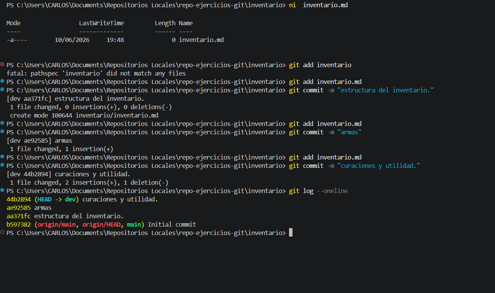

# Ejercicio: Control de versiones y trazabilidad de cambios en Git

## Descripción
En este ejercicio se realizó la gestión del historial de cambios de un archivo mediante el flujo de trabajo de Git. El proceso incluyó:

* **Inicialización de archivos:** Creación del archivo `inventario.md` para el seguimiento de elementos del proyecto.
* **Control de versiones (Staging y Commit):** Uso del ciclo de trabajo estándar de Git para registrar hitos específicos en el historial. Se aplicaron cambios incrementales (estructura, armas, curaciones) asegurando una trazabilidad clara.
* **Verificación de historial:** Uso del comando `git log` para auditar los cambios realizados y confirmar que el HEAD apunta a la versión más reciente en la rama de desarrollo (`dev`).

### Estructura del Proyecto
```text
inventario/
└── inventario.md

```

## Comandos Utilizados

Para registrar y visualizar el historial de cambios, se utilizaron los siguientes comandos:

```powershell
# ni: Crea el archivo de texto para el inventario.
ni inventario.md

# git add: Prepara los cambios del archivo para ser incluidos en el próximo commit.
git add inventario.md

# git commit -m: Guarda una instantánea del proyecto con un mensaje descriptivo del cambio.
git commit -m "Descripción del cambio"

# git log --oneline: Muestra el historial de commits de forma simplificada y lineal.
git log --oneline

```

## Evidencia

---

**Hecho por:**

* *Carlos Velasco*
