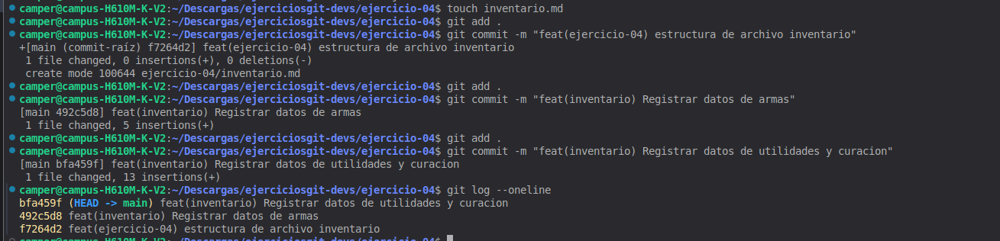

## Explicacion
Mi solucion fue desestructurar el problema y ir paso a paso ver que era lo primero que me pedian crear luego seguir con el siguiente paso para el final ver si cumpli con todos los pasos que me pidieron o si me hizo falta alguno. Ademas de eso en esto en este ejercicio se creo el archivo inventario 

## Comando utilizados 
touch -> para crear el archivo 
git add. -> para guardar los cambios 
git commit -m "" -> para hacer los commits 
git log --oneline -> para ver los commits hechos 

## Evidencia 
