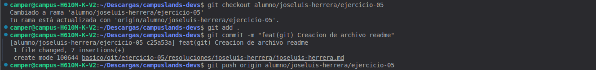

## Taller de motos 

## Explicacion 
Se verifico si se estaba en la rama indicada para poder trabajar luego de eso se procedio a hacer un git add . para guardar 
los cambios y siguiendo con un commit para ver en donde se realizaron los cambios y cuales fueron, 
ademas de eso se hizo un git push origin para verificar si los cambios estan guardados. 

