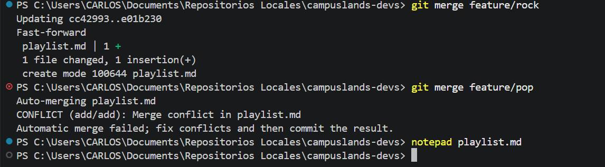
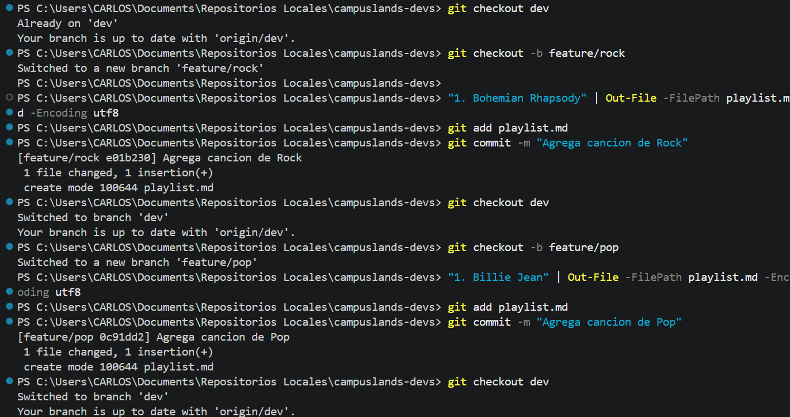
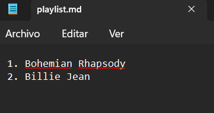
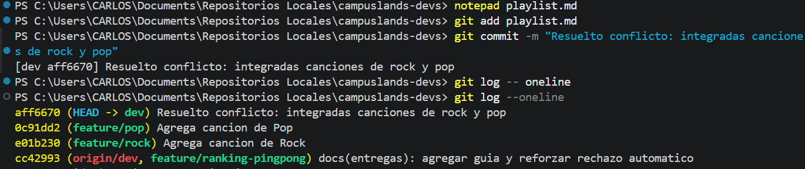

# Conflicto simple en playlist musical
## Gestión de Conflictos en Git: Integración de Ramas

Este ejercicio documenta el proceso técnico para resolver un conflicto de fusión (*merge conflict*) en Git al intentar integrar cambios concurrentes provenientes de dos ramas de características (*feature branches*) en la rama de desarrollo principal (`dev`).

* **Descripción del proceso:**
* **Creación de ramas:** Se crearon las ramas `feature/rock` y `feature/pop` desde `dev`. En cada una, se añadió una canción distinta al archivo `playlist.md` y se realizaron sus respectivos *commits*.
* **Fusión inicial:** Al integrar `feature/rock` en `dev`, la operación se realizó con éxito mediante *fast-forward*.
* **Resolución de conflictos:** Al intentar integrar `feature/pop`, se generó un conflicto de tipo *add/add* en el archivo `playlist.md`. Se procedió a editar manualmente el archivo utilizando `notepad` para unificar ambos cambios (Bohemian Rhapsody y Billie Jean), seguido de la adición (`git add`) y confirmación (`git commit`) del resultado final.


* **Tecnologías:**
* Git (Control de versiones).
* Windows PowerShell.
* Markdown.


### Comandos de Git / Lógica del Código

```bash
# Integración inicial de rama feature/rock
git merge feature/rock

# Intento de integración de rama feature/pop (genera conflicto)
git merge feature/pop

# Apertura del archivo conflictivo para edición manual
notepad playlist.md

# Resolución y confirmación del conflicto
git add playlist.md
git commit -m "Resuelto conflicto: integradas canciones de rock y pop"

# Verificación del historial de commits
git log --oneline

```

**Evidencia**

* **evidencia_01.png:** Muestra el éxito de la primera fusión y el conflicto detectado en la segunda.


* **evidencia_02.png:** Detalla la creación de ramas, la adición de contenido y los *commits* individuales.


* **evidencia_03.png:** Visualización del archivo `playlist.md` tras la resolución manual del conflicto.



* **evidencia_04.png:** Registro del *commit* de resolución y visualización del historial en `git log`.



**Estructura del Proyecto:**

```plaintext
campuslands-devs/
├── .git/
└── playlist.md

```

Hecho por:
Carlos Velasco