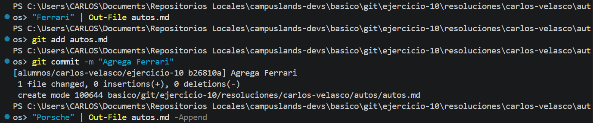
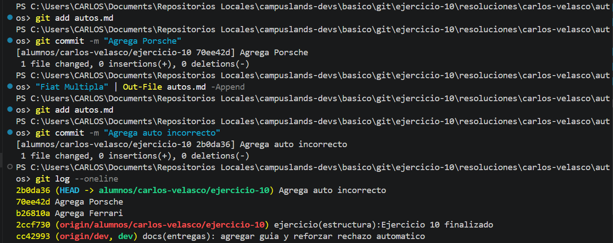
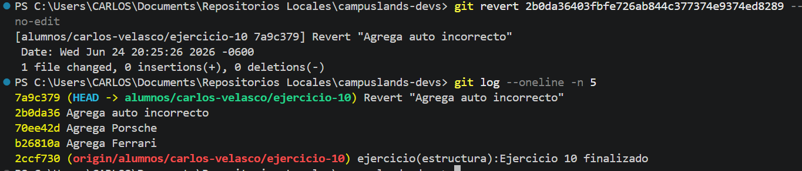

# Revertir idea sin borrar historial
Aquí tienes el archivo `README.md` solicitado, junto con la explicación técnica sobre cómo gestionar errores en el historial sin eliminar el trabajo previo.

---

## Gestión de Historial en Git: Uso de Revert

Este ejercicio documenta el proceso de corrección de errores en un flujo de trabajo mediante el uso de `git revert`, una técnica que permite deshacer cambios de un *commit* específico creando un nuevo *commit* de reversión. Esto mantiene la integridad y trazabilidad del historial del proyecto.

* **Descripción del proceso:**
* **Registro incremental:** Se construyó el archivo `autos.md` mediante comandos de terminal, realizando *commits* individuales para cada marca (Ferrari, Porsche, Fiat Multipla).
* **Detección de inconsistencia:** Se identificó que el registro "Fiat Multipla" no debía formar parte del archivo, por lo que el *commit* `2b0da36` se marcó como erróneo.
* **Aplicación de reversión:** Se utilizó la instrucción `git revert` para neutralizar automáticamente los cambios introducidos por dicho *commit* sin alterar los registros anteriores.


* **Tecnologías:**
* Git (Control de versiones).
* Windows PowerShell.


### Comandos de Git / Lógica del Código

```bash
# Inserción de datos y confirmación de cambios
"Ferrari" | Out-File autos.md
git add autos.md
git commit -m "Agrega Ferrari"

"Porsche" | Out-File autos.md -Append
git add autos.md
git commit -m "Agrega Porsche"

"Fiat Multipla" | Out-File autos.md -Append
git add autos.md
git commit -m "Agrega auto incorrecto"

# Reversión: Crea un nuevo commit que deshace los cambios del commit 2b0da36
git revert 2b0da36 --no-edit

```
---

### Explicación técnica: ¿Cómo revertir sin borrar el historial?

A diferencia de `git reset` (que elimina commits del historial y puede ser peligroso en repositorios compartidos), **`git revert` es la forma segura y colaborativa de corregir errores.**

1. **¿Cómo funciona?** Git toma el contenido del *commit* que quieres deshacer y calcula el "opuesto" de esos cambios. Luego, crea un **nuevo *commit*** con ese contenido inverso.
2. **¿Por qué no borra el historial?** Al crear un *commit* nuevo, no estás "reescribiendo" el pasado, simplemente estás añadiendo un evento nuevo que dice: *"a partir de este punto, lo que se hizo antes queda anulado"*.
3. **Ventaja principal:** Si trabajas con otros desarrolladores, ellos no tendrán problemas de sincronización en sus ramas, ya que el historial de commits anteriores se mantiene intacto.

**Comando clave:**
`git revert <hash_del_commit>`

* El `--no-edit` se utiliza para que Git no abra el editor de texto y utilice el mensaje de *commit* predeterminado automáticamente, lo cual agiliza el flujo de trabajo en terminal.

**Evidencia**

* **evidencia_01.png y 02.png:** Muestran el proceso de creación y el historial previo a la corrección.





* **evidencia_03.png:** Confirma la ejecución exitosa de `git revert` y cómo el nuevo *commit* de reversión aparece en el `git log`.



**Estructura del Proyecto:**

```plaintext
campuslands-devs/
└── basico/
    └── git/
        └── ejercicio-10/
            └── resoluciones/
                └── carlos-velasco/
                    └── autos/
                        └── autos.md

```

Hecho por:
Carlos Velasco

