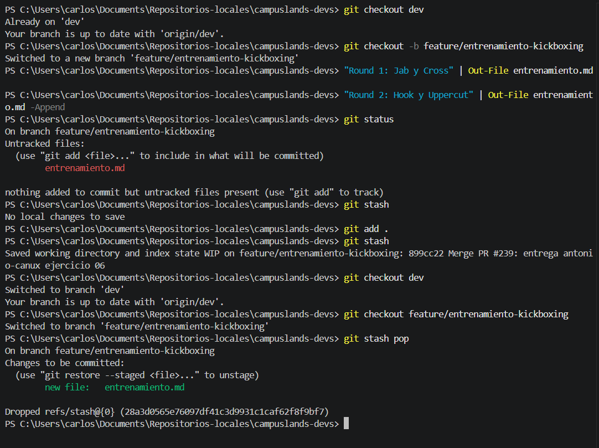

# Stash durante urgencia de kickboxing

## Gestión Temporal de Cambios con Git Stash

Este ejercicio documenta el uso de `git stash`, una herramienta esencial en Git que permite guardar temporalmente cambios que aún no están listos para ser confirmados (*commit*), permitiendo al desarrollador cambiar de contexto (cambiar de rama) sin perder su trabajo.

* **Descripción del proceso:**
* **Creación de cambios:** Se generó el archivo `entrenamiento.md` con contenido inicial en la rama `feature/entrenamiento-kickboxing`.
* **Resguardo temporal:** Ante la necesidad de cambiar de rama, se utilizó `git stash` para "guardar en el cajón" los cambios no confirmados.
* **Recuperación:** Tras retornar a la rama de trabajo, se utilizó `git stash pop` para aplicar nuevamente los cambios guardados al área de trabajo (*working directory*).


* **Tecnologías:**
* Git (Control de versiones).
* Windows PowerShell.

### Explicación técnica: ¿Para qué sirve `git stash`?

`git stash` es fundamental para mantener un flujo de trabajo limpio. Su utilidad principal radica en los siguientes puntos:

1. **Cambio de contexto rápido**: Si estás trabajando en una funcionalidad y surge una emergencia (un *hotfix* o bug crítico en otra rama), no necesitas hacer un *commit* incompleto o "sucio". Puedes hacer *stash*, cambiar de rama, resolver la emergencia y volver.
2. **Limpieza del área de trabajo**: Permite "limpiar" tu directorio actual moviendo los cambios modificados a un almacenamiento interno de Git, dejando tu rama en el estado del último *commit*.
3. **Seguridad**: `git stash pop` no solo aplica los cambios, sino que también elimina esa entrada del historial de *stash* una vez que se han aplicado con éxito, manteniendo tu gestión de archivos ordenada.

**Comandos clave:**

* `git stash`: Guarda los cambios modificados y en el área de preparación (*staging*).
* `git stash pop`: Aplica los cambios guardados más recientemente y los elimina del almacenamiento de *stash*.
* `git stash list`: Permite listar todos los cambios guardados temporalmente si tienes más de uno.


### Comandos de Git / Lógica del Código

```bash
# 1. Crear rama y generar archivos
git checkout -b feature/entrenamiento-kickboxing
"Round 1: Jab y Cross" | Out-File entrenamiento.md

# 2. Guardar cambios en el "stash"
git add .
git stash

# 3. Cambiar de contexto y retornar
git checkout dev
git checkout feature/entrenamiento-kickboxing

# 4. Recuperar los cambios del stash
git stash pop

```

**Evidencia**


* Muestra la secuencia de creación del archivo, el uso de `git stash` para salvaguardar el progreso, el cambio de rama y la recuperación final con `git stash pop`.

**Estructura del Proyecto:**

```plaintext
campuslands-devs/
└── basico/
    └── git/
        └── ejercicio-11/
            └── entrenamiento.md

```

Hecho por:
Carlos Velasco

---

