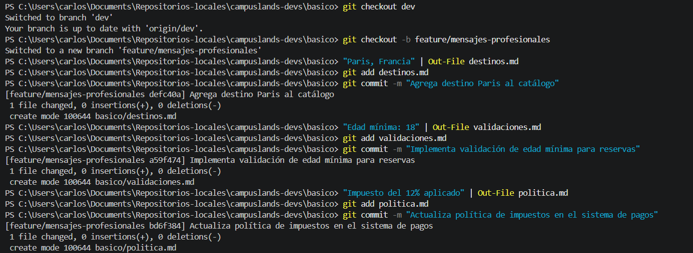
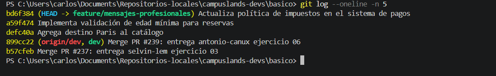

# Guía de Commits Profesionales y Legibles

Este documento explica la importancia y la estructura para escribir mensajes de *commit* profesionales, claros y coherentes en Git. Un buen mensaje de *commit* es vital para la colaboración en equipo y el mantenimiento a largo plazo de cualquier proyecto.

## ¿Por qué es importante?

1. **Trazabilidad:** Facilita entender qué cambios se hicieron y por qué, sin necesidad de leer el código línea por línea.
2. **Colaboración:** Permite que otros desarrolladores comprendan rápidamente el contexto de una contribución.
3. **Mantenimiento:** Ayuda a depurar errores eficientemente mediante el historial de cambios (`git log`).

## Estructura Recomendada

Aunque las convenciones pueden variar, una estructura profesional sigue este patrón:

* **Formato imperativo:** Escribe el mensaje como si estuvieras dando una orden (ej: "Agrega", "Implementa", "Actualiza", en lugar de "Agregado", "Implementando").
* **Brevedad:** Mantén el resumen inicial por debajo de 50 caracteres.
* **Claridad:** Sé específico sobre qué parte del sistema se modificó y qué funcionalidad se añadió o corrigió.

---

### Explicación técnica: ¿Por qué es crucial este flujo?

Escribir *commits* de forma profesional no es solo una convención estética, es una **necesidad operativa** en equipos de desarrollo:

1. **Contexto inmediato**: Cuando regresas a un proyecto después de semanas, los mensajes como "arreglo esto" o "cambio" no ayudan. Un mensaje profesional como *"Actualiza política de impuestos"* te sitúa instantáneamente en el contexto de la modificación realizada.
2. **Facilidad de `git log**`: Al utilizar `git log --oneline`, el historial se convierte en una lista de lectura rápida. Si todos los *commits* siguen una estructura imperativa y clara, cualquier desarrollador puede entender la evolución del proyecto en segundos.
3. **Seguridad y Rollback**: Si un *commit* causa un error, es mucho más sencillo identificar cuál revertir o analizar si su mensaje es claro y describe exactamente qué funcionalidad tocó.

## Ejemplos Basados en el Ejercicio de Reservas

En el ejercicio práctico, se implementaron mensajes descriptivos y profesionales siguiendo estas pautas:

| Comando | Mensaje de Commit | Propósito |
| --- | --- | --- |
| `git commit -m "Agrega destino Paris al catálogo"` | Profesional | Claro, imperativo y específico. |
| `git commit -m "Implementa validación de edad mínima para reservas"` | Profesional | Describe la lógica de negocio añadida. |
| `git commit -m "Actualiza política de impuestos en el sistema de pagos"` | Profesional | Indica qué área del sistema fue afectada. |

## Evidencia del Historial Profesional

La siguiente evidencia muestra cómo los *commits* bien estructurados hacen que `git log --oneline` sea una herramienta de auditoría mucho más efectiva:

---

Hecho por: Carlos Velasco

